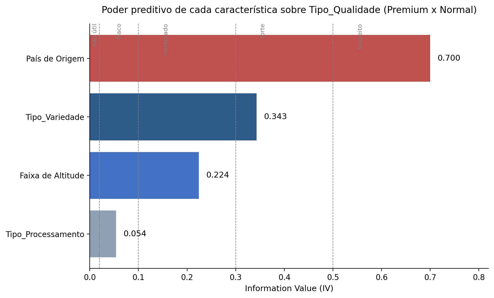
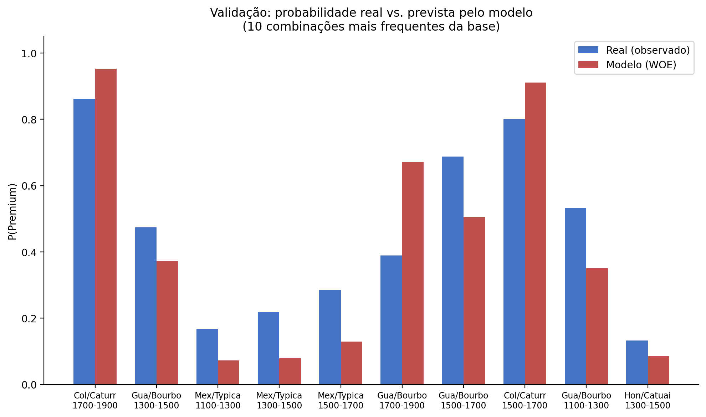

# Credit Guarantee Pricing with IV and WOE: An Agricultural Credit Case Study

A credit-scoring model to estimate the guarantee value of coffee sacks pledged in credit operations, using Information Value (IV) and Weight of Evidence (WOE) — the same techniques real banks use to assess risk.

📄 **Read the full analysis on Medium:** (https://medium.com/@vitor.grc89/precifica%C3%A7%C3%A3o-de-garantias-de-cr%C3%A9dito-com-iv-e-woe-um-case-de-cr%C3%A9dito-agr%C3%ADcola-f68f19a2bd1b?postPublishedType=initial)

## Business Problem

AgroTech Bank (fictional case) lends to rural producers using coffee sacks as collateral. The Guarantees team needed a calculator that, given 4 characteristics of a coffee lot (country of origin, variety, processing method, and cultivation altitude range), could estimate:

1. **Which coffee characteristics increase the likelihood of it being classified as Premium** (Premium coffee is worth more as collateral than Normal coffee)?
2. **A calculator** that, given those characteristics and the quantity of sacks offered, computes the approximate guarantee value and the maximum loan amount that can be released (70% of the guarantee value).

## Data

A dataset of 862 coffee lot records, each with:
- Country of origin, variety, processing method, cultivation altitude range
- Quality classification: Normal or Premium

## Methodology

**1. Information Value (IV)** — measures each variable's predictive power over the Normal/Premium classification. Per-category formula: `(%Premium - %Normal) × ln(%Premium / %Normal)`, summed across all categories of the variable.

**2. Handling sparsity** — Country of Origin and Variety have roughly 23 and 19 categories respectively, several with fewer than 10 observations. Categories with few records produce an artificially inflated IV (a single "Premium" observation in a rare category skews the calculation). Categories with fewer than 15 observations were grouped into an "Other" bucket before computing IV.

**3. Weight of Evidence (WOE)** — for each category, `WOE = ln(Odds)`, where `Odds = Premium / Normal` for that category. This puts each category's effect on an additive (log) scale.

**4. Combining the 4 variables** — assuming independence between them (a Naive Bayes / credit-scorecard style approach):
```
log_odds(Premium) = ln(Total_Premium/Total_Normal) + WOE_Country + WOE_Variety + WOE_Processing + WOE_Altitude
Odds = EXP(log_odds)
P(Premium) = Odds / (1 + Odds)
```

## Key Findings



- **Country of Origin** (IV = 0.70) and **Variety** (IV = 0.34) are by far the characteristics most associated with the Premium classification
- **Altitude Range** has moderate influence (IV = 0.22)
- **Processing Method** has low standalone predictive power (IV = 0.05)
- Country of Origin's IV (0.70) exceeds the conventional "suspicious" threshold (>0.5) — not due to a calculation error, but because countries like Colombia (85% Premium) and Mexico (74% Normal) show very extreme class splits even in large samples (117 and 223 records, respectively)

## The Calculator

Given the user's 4 selections and the sack quantity, the calculator:
1. Looks up the WOE for each selected characteristic (VLOOKUP against the WOE tables)
2. Sums the 4 WOEs with the sample's base log-odds
3. Converts the result into a Premium probability
4. Computes the expected value per sack: `Premium Price × P(Premium) + Normal Price × (1 - P(Premium))`
5. Multiplies by the sack quantity, and applies 70% to get the maximum loan amount

## Model Validation

The additive WOE combination assumes the 4 variables are independent of one another — in practice, this doesn't always hold. Testing the model against the actual observed frequency across the 10 most common combinations in the dataset:



**Mean absolute error: ~14 percentage points.** The model consistently gets the *direction* right — it never flipped whether the probability should be high or low — but the *magnitude* carries a meaningful margin of error, especially where two variables are strongly correlated with each other. The clearest case: **92.3% of all Colombian coffee in the dataset is the Caturra variety**. Selecting "Colombia" + "Caturra" together makes the model sum the effect of two variables that, in practice, carry nearly the same signal — inflating the predicted probability (95.3% predicted vs. 86.2% actual for that specific combination).

## Repository Structure

```
├── data/
│   └── coffee_base.xlsx             # Case dataset (862 records)
├── spreadsheets/
│   └── full_calculator.xlsx         # Full workbook: Metadata, Base, Calculator, Analysis, Validation
├── imagens/
│   ├── iv_ranking.png
│   └── validacao_modelo.png
└── README.md
```

## Limitations & Next Steps

- The model assumes independence between the 4 characteristics, which doesn't fully hold — Country and Variety are strongly correlated in practice
- A natural extension would be training a full logistic regression (which estimates interactions between variables) and comparing its performance against this additive-WOE approach
- A simpler, more immediate alternative: apply a conservative adjustment factor to the guarantee value when the selected combination involves strongly correlated characteristics
- Worth investigating whether Country of Origin's unusually high IV reflects a genuine market pattern or an artifact of how this particular dataset was built

---

*Project developed as part of my portfolio for transitioning into a data career.*
